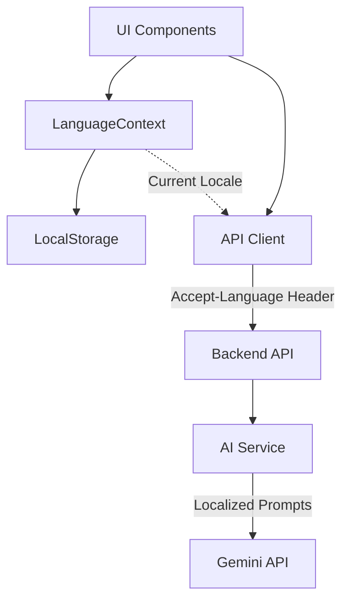

# Design Document: Multilingual Support

## Overview

This design implements comprehensive bilingual support (Russian and Kazakh) for the EduStream educational platform. The solution extends the existing LanguageContext to support Kazakh (kk) alongside Russian (ru) and English (en), modifies the AI service to generate content in the selected language, and ensures all UI components are properly localized.

The implementation follows a layered approach:
- **Frontend Layer**: Extended LanguageContext with Kazakh translations, language switcher UI, and locale-aware formatting
- **API Layer**: Accept-Language header support and language parameter propagation
- **AI Service Layer**: Localized prompts and language-specific content generation
- **Persistence Layer**: User language preference storage in localStorage

This design maintains backward compatibility with existing functionality while adding new language capabilities without breaking changes.

## Architecture

### System Components



### Component Responsibilities

**LanguageContext (Frontend)**
- Manages current locale state (ru, en, kk)
- Provides translation function `t(key)`
- Persists language preference to localStorage
- Exposes language setter for UI components

**Translation Service (Frontend)**
- Stores translation dictionaries for all supported locales
- Provides fallback mechanism for missing keys
- Supports namespaced translation keys

**API Client (Frontend)**
- Injects Accept-Language header into all HTTP requests
- Reads current locale from LanguageContext
- Handles locale-specific error messages

**Backend API Endpoints**
- Reads Accept-Language header from requests
- Validates and defaults locale to 'ru' if unsupported
- Passes locale to AI Service methods
- Returns localized error messages

**AI Service (Backend)**
- Modifies prompts based on target language
- Instructs Gemini to respond in specified language
- Validates generated content matches requested language
- Maintains language-specific prompt templates

### Data Flow

1. User selects language in Settings → LanguageContext updates state
2. LanguageContext persists preference to localStorage
3. All UI components re-render with new translations
4. API requests include Accept-Language header with current locale
5. Backend reads header and passes locale to AI Service
6. AI Service generates content in requested language
7. Response returns to frontend with localized content

## Components and Interfaces

### Frontend Components

#### Extended LanguageContext

```typescript
type Language = 'ru' | 'en' | 'kk';

interface LanguageContextType {
    language: Language;
    setLanguage: (lang: Language) => void;
    t: (key: string) => string;
}
```

**Key Changes:**
- Add 'kk' to Language type
- Extend translations object with Kazakh dictionary
- Maintain existing API for backward compatibility

#### Language Switcher Component

```typescript
interface LanguageSwitcherProps {
    className?: string;
}

// Renders in Settings page
// Displays: Русский | English | Қазақша
// Shows active language with visual indicator
```

#### Translation Keys Structure

```typescript
translations = {
    ru: { 'nav.dashboard': 'Дашборд', ... },
    en: { 'nav.dashboard': 'Dashboard', ... },
    kk: { 'nav.dashboard': 'Басты бет', ... }
}
```

**Namespaces:**
- `nav.*` - Navigation menu items
- `dash.*` - Dashboard page
- `ocr.*` - OCR/grading page
- `ai.*` - AI workspace
- `analytics.*` - Analytics page
- `settings.*` - Settings page
- `auth.*` - Authentication pages

### Backend Components

#### API Endpoint Modifications

**Accept-Language Header Handling:**

```python
from fastapi import Header
from typing import Optional

async def get_language(
    accept_language: Optional[str] = Header(None)
) -> str:
    """Extract and validate language from Accept-Language header."""
    if accept_language:
        # Parse header: "kk,ru;q=0.9,en;q=0.8"
        lang = accept_language.split(',')[0].split(';')[0].strip().lower()
        if lang in ['ru', 'kk', 'en']:
            return lang
    return 'ru'  # Default to Russian
```

**Updated Endpoint Signatures:**

```python
@router.post("/ai/generate-summary")
async def generate_summary(
    request: GenerateSummaryRequest,
    language: str = Depends(get_language),
    db: Session = Depends(get_db),
    current_user: User = Depends(get_current_teacher)
):
    result = await ai_service.generate_summary(
        material.raw_text,
        language=language
    )
```

#### AI Service Interface

**Modified Method Signatures:**

```python
class AIService:
    async def generate_summary(
        self, 
        text: str,
        language: str = 'ru'
    ) -> Dict[str, any]:
        """Generate summary in specified language."""
        
    async def generate_quiz(
        self, 
        text: str, 
        num_questions: int = 5, 
        difficulty: str = "medium",
        language: str = 'ru'
    ) -> List[Dict]:
        """Generate quiz in specified language."""
        
    async def generate_quiz_advanced(
        self,
        text: str,
        count: int,
        difficulty: str,
        question_type: str,
        language: str = 'ru'
    ) -> List[Dict]:
        """Advanced quiz generation in specified language."""
        
    async def chat_with_context(
        self, 
        message: str, 
        context: str = "",
        language: str = 'ru'
    ) -> str:
        """RAG chat in specified language."""
        
    async def perform_smart_action(
        self,
        text: str,
        action: str,
        context: Optional[str] = None,
        language: str = 'ru'
    ) -> str:
        """Smart actions in specified language."""
        
    async def evaluate_assignment_submission(
        self,
        assignment_text: str,
        student_answer: str,
        max_score: int = 20,
        language: str = 'ru'
    ) -> Dict[str, any]:
        """Evaluate assignment with feedback in specified language."""
        
    async def generate_assignment(
        self,
        text: str,
        instruction: str = "",
        language: str = 'ru'
    ) -> str:
        """Generate assignment in specified language."""
```

## Data Models

### Language Preference Storage

**Frontend (localStorage):**
```typescript
// Key: 'appLanguage'
// Value: 'ru' | 'en' | 'kk'
localStorage.setItem('appLanguage', 'kk');
```

**Migration Strategy:**
- Existing users with no preference → default to 'ru'
- Existing 'en' preferences → migrate to 'ru' for consistency
- New users → default to 'ru'

### API Request/Response Models

**Request Headers:**
```
Accept-Language: kk
Accept-Language: ru,kk;q=0.9,en;q=0.8
```

**Response Metadata (optional):**
```json
{
    "data": { ... },
    "meta": {
        "language": "kk"
    }
}
```

### Translation Dictionary Structure

```typescript
type TranslationDictionary = {
    [locale: string]: {
        [key: string]: string
    }
}

// Example:
{
    "ru": {
        "nav.dashboard": "Дашборд",
        "ocr.save": "Сохранить"
    },
    "kk": {
        "nav.dashboard": "Басты бет",
        "ocr.save": "Сақтау"
    }
}
```


## Correctness Properties

*A property is a characteristic or behavior that should hold true across all valid executions of a system—essentially, a formal statement about what the system should do. Properties serve as the bridge between human-readable specifications and machine-verifiable correctness guarantees.*

### Property Reflection

After analyzing all acceptance criteria, I identified the following testable properties. Several criteria were redundant or overlapping:

- Requirements 1.5 and 12.2 both test default language behavior (consolidated)
- Requirements 3.3 and 12.5 both test backend default behavior (consolidated)
- Requirements 4.6 and 9.1 both test prompt language instructions (consolidated)
- Requirements 7.1 and 7.2 overlap (7.2 is subset of 7.1, consolidated)
- Requirements 11.1 and 11.2 state the same property (consolidated)

Many requirements (5.1-5.5, 6.4, 9.2-9.4, 10.3, 11.3-11.5) are integration tests, manual reviews, or code quality criteria that are not suitable for property-based testing.

### Property 1: Language Preference Persistence

*For any* valid language code (ru, en, kk), when a user selects that language, the system SHALL persist it to localStorage and restore it on subsequent application loads.

**Validates: Requirements 1.3, 1.4, 12.1**

### Property 2: Translation Dictionary Completeness

*For any* translation key that exists in the Russian (ru) dictionary, the same key SHALL exist in the Kazakh (kk) dictionary with a non-empty value.

**Validates: Requirements 2.1**

### Property 3: Backend Language Parameter Validation

*For any* API request with a language parameter, the backend SHALL accept valid language codes (ru, kk, en) and reject invalid codes, defaulting to 'ru' for unsupported or missing values.

**Validates: Requirements 3.2, 3.3, 12.5**

### Property 4: API Response Locale Metadata

*For any* API response from the backend, the response SHALL include metadata indicating the applied locale.

**Validates: Requirements 3.5**

### Property 5: AI Summary Language Consistency

*For any* text input and language parameter (ru, kk), the AI service SHALL generate a summary where the output language matches the requested language parameter.

**Validates: Requirements 4.1**

### Property 6: AI Quiz Language Consistency

*For any* text input and language parameter (ru, kk), the AI service SHALL generate quiz questions where all questions, options, and explanations are in the requested language.

**Validates: Requirements 4.2**

### Property 7: AI Chat Language Consistency

*For any* chat message and language parameter (ru, kk), the AI service SHALL generate a response in the requested language.

**Validates: Requirements 4.3**

### Property 8: AI Smart Action Language Consistency

*For any* smart action (explain, simplify, translate, summarize) and language parameter (ru, kk), the AI service SHALL generate output in the requested language.

**Validates: Requirements 4.4**

### Property 9: AI Assignment Evaluation Language Consistency

*For any* assignment evaluation and language parameter (ru, kk), the AI service SHALL provide feedback, strengths, and improvements in the requested language.

**Validates: Requirements 4.5**

### Property 10: AI Prompt Language Instructions

*For any* AI service method call with a language parameter, the constructed prompt SHALL include explicit instructions for the AI model to respond in the target language.

**Validates: Requirements 4.6, 9.1**

### Property 11: Frontend API Request Language Header

*For any* API request made by the frontend, the request SHALL include an Accept-Language header with the current locale value from LanguageContext.

**Validates: Requirements 7.1, 7.2, 7.3**

### Property 12: Backend Language Propagation

*For any* API request with an Accept-Language header, the backend SHALL extract the language value and pass it to AI service operations.

**Validates: Requirements 7.4**

### Property 13: Translation Key Fallback

*For any* translation key that does not exist in the current locale dictionary, the translation function SHALL return the key itself as a fallback value.

**Validates: Requirements 8.4, 8.5**

### Property 14: Date Formatting Locale Consistency

*For any* date value and locale (ru, kk), the frontend SHALL format the date according to the locale's conventions.

**Validates: Requirements 10.1**

### Property 15: Number Formatting Locale Consistency

*For any* number value and locale (ru, kk), the frontend SHALL format the number using appropriate decimal and thousand separators for that locale.

**Validates: Requirements 10.2**

### Property 16: Locale-Aware Text Sorting

*For any* list of strings and locale (ru, kk), the frontend SHALL sort the list according to the locale's collation rules.

**Validates: Requirements 10.4**

### Property 17: Relative Time Translation

*For any* relative time phrase (e.g., "2 hours ago") and locale (ru, kk), the frontend SHALL display the phrase translated to the selected locale.

**Validates: Requirements 10.5**

### Property 18: User Content Language Preservation

*For any* user-generated content (course names, material titles, notes) and UI locale change, the content SHALL remain in its original language without automatic translation.

**Validates: Requirements 11.1, 11.2**

### Property 19: Backward Compatibility

*For any* existing API endpoint, requests without a language parameter SHALL continue to function correctly with Russian (ru) as the default language.

**Validates: Requirements 12.4**


## Error Handling

### Frontend Error Scenarios

**Missing Translation Key**
- Behavior: Display the key itself as fallback text
- User Impact: Minimal - key names are descriptive
- Logging: Console warning in development mode
- Example: `t('unknown.key')` returns `'unknown.key'`

**Invalid Language Code**
- Behavior: Ignore invalid code, maintain current language
- User Impact: None - language doesn't change
- Logging: Console warning
- Example: `setLanguage('invalid')` is ignored

**localStorage Unavailable**
- Behavior: Language selection works but doesn't persist
- User Impact: Language resets to 'ru' on page reload
- Fallback: In-memory state management
- User Notification: None (graceful degradation)

**API Request Failure with Language Header**
- Behavior: Standard API error handling applies
- User Impact: Error message displayed in current UI language
- Retry: Standard retry logic
- Fallback: None needed

### Backend Error Scenarios

**Unsupported Language Parameter**
- Behavior: Default to Russian (ru)
- HTTP Status: 200 OK (not an error)
- Response: Include actual applied language in metadata
- Logging: Info level log of language fallback

**AI Service Language Generation Failure**
- Behavior: Return error response
- HTTP Status: 500 Internal Server Error
- Error Message: "Failed to generate content in requested language"
- Logging: Error level with language parameter and AI response
- User Action: Retry or switch language

**Malformed Accept-Language Header**
- Behavior: Parse first valid language code, default to 'ru' if none
- HTTP Status: 200 OK
- Logging: Warning level
- Example: `Accept-Language: ;;;invalid` → defaults to 'ru'

**AI Model Returns Wrong Language**
- Behavior: Detect language mismatch (optional validation)
- HTTP Status: 500 Internal Server Error
- Error Message: "Generated content language mismatch"
- Logging: Error level with expected vs actual language
- Fallback: Return content anyway with warning in metadata

### Error Recovery Strategies

**Translation Loading Failure**
- Primary: Use embedded translations (no external loading)
- Secondary: Fall back to Russian translations
- Tertiary: Display translation keys

**Language Preference Corruption**
- Detection: Validate localStorage value on load
- Recovery: Reset to default 'ru'
- User Notification: None (silent recovery)

**Partial Translation Coverage**
- Detection: Development-time checks for missing keys
- Runtime: Fallback to key display
- Resolution: Add missing translations in next release

## Testing Strategy

### Unit Testing

**Frontend Unit Tests (Jest + React Testing Library)**

1. **LanguageContext Tests**
   - Test language state initialization from localStorage
   - Test language setter updates state and localStorage
   - Test translation function returns correct strings
   - Test fallback behavior for missing keys
   - Test default language when no preference exists
   - Test migration of 'en' preference to 'ru'

2. **Language Switcher Component Tests**
   - Test component renders all language options
   - Test active language is visually indicated
   - Test clicking language option calls setLanguage
   - Test keyboard navigation works correctly

3. **Translation Dictionary Tests**
   - Test all Russian keys have Kazakh equivalents
   - Test no empty translation values
   - Test translation keys follow naming convention

4. **Locale Formatting Tests**
   - Test date formatting for ru and kk locales
   - Test number formatting for ru and kk locales
   - Test relative time translation for ru and kk
   - Test locale-aware sorting for Cyrillic text

**Backend Unit Tests (pytest)**

1. **Language Parameter Extraction Tests**
   - Test Accept-Language header parsing
   - Test valid language codes are accepted
   - Test invalid language codes default to 'ru'
   - Test missing header defaults to 'ru'
   - Test malformed header handling

2. **AI Service Prompt Construction Tests**
   - Test prompts include language instructions for 'ru'
   - Test prompts include language instructions for 'kk'
   - Test all AI methods construct language-aware prompts
   - Test prompt templates are correctly selected

3. **API Endpoint Language Propagation Tests**
   - Test language parameter is passed to AI service
   - Test response metadata includes applied language
   - Test error messages respect requested language

### Property-Based Testing

**Property Test Configuration:**
- Library: fast-check (Frontend), Hypothesis (Backend)
- Minimum iterations: 100 per property
- Tag format: `Feature: multilingual-support, Property {number}: {description}`

**Frontend Property Tests**

1. **Property 1: Language Preference Persistence**
   - Generator: Random language code from ['ru', 'en', 'kk']
   - Test: Set language → reload → verify language matches
   - Tag: `Feature: multilingual-support, Property 1: Language preference persistence`

2. **Property 2: Translation Dictionary Completeness**
   - Generator: All keys from Russian dictionary
   - Test: For each key, verify Kazakh dictionary has same key
   - Tag: `Feature: multilingual-support, Property 2: Translation dictionary completeness`

3. **Property 13: Translation Key Fallback**
   - Generator: Random non-existent translation keys
   - Test: t(key) returns key itself
   - Tag: `Feature: multilingual-support, Property 13: Translation key fallback`

4. **Property 14: Date Formatting Locale Consistency**
   - Generator: Random dates and locales ['ru', 'kk']
   - Test: Formatted date matches locale conventions
   - Tag: `Feature: multilingual-support, Property 14: Date formatting locale consistency`

5. **Property 15: Number Formatting Locale Consistency**
   - Generator: Random numbers and locales ['ru', 'kk']
   - Test: Formatted number uses correct separators
   - Tag: `Feature: multilingual-support, Property 15: Number formatting locale consistency`

6. **Property 16: Locale-Aware Text Sorting**
   - Generator: Random lists of Cyrillic strings and locales
   - Test: Sorted list follows locale collation rules
   - Tag: `Feature: multilingual-support, Property 16: Locale-aware text sorting`

7. **Property 17: Relative Time Translation**
   - Generator: Random time offsets and locales
   - Test: Relative time phrase is translated
   - Tag: `Feature: multilingual-support, Property 17: Relative time translation`

8. **Property 18: User Content Language Preservation**
   - Generator: Random user content and locale changes
   - Test: Content remains unchanged after locale switch
   - Tag: `Feature: multilingual-support, Property 18: User content language preservation`

**Backend Property Tests**

1. **Property 3: Backend Language Parameter Validation**
   - Generator: Random language codes (valid and invalid)
   - Test: Valid codes accepted, invalid default to 'ru'
   - Tag: `Feature: multilingual-support, Property 3: Backend language parameter validation`

2. **Property 4: API Response Locale Metadata**
   - Generator: Random API requests with language parameters
   - Test: Response includes locale metadata
   - Tag: `Feature: multilingual-support, Property 4: API response locale metadata`

3. **Property 10: AI Prompt Language Instructions**
   - Generator: Random AI service methods and languages
   - Test: Constructed prompt contains language instruction
   - Tag: `Feature: multilingual-support, Property 10: AI prompt language instructions`

4. **Property 12: Backend Language Propagation**
   - Generator: Random Accept-Language headers
   - Test: Extracted language is passed to AI service
   - Tag: `Feature: multilingual-support, Property 12: Backend language propagation`

5. **Property 19: Backward Compatibility**
   - Generator: Random API requests without language parameter
   - Test: Request succeeds with 'ru' as default
   - Tag: `Feature: multilingual-support, Property 19: Backward compatibility`

### Integration Testing

**Frontend Integration Tests**

1. **End-to-End Language Switching**
   - Navigate to Settings page
   - Switch language to Kazakh
   - Verify all visible UI elements update
   - Verify localStorage is updated
   - Reload page and verify language persists

2. **API Request Language Header**
   - Mock API client
   - Make various API requests
   - Verify Accept-Language header is included
   - Verify header value matches LanguageContext

3. **Mixed Content Rendering**
   - Create user content in Russian
   - Switch UI to Kazakh
   - Verify user content remains in Russian
   - Verify UI elements are in Kazakh

**Backend Integration Tests**

1. **AI Content Generation in Kazakh**
   - Send material text with language='kk'
   - Generate summary
   - Manually verify summary is in Kazakh
   - Generate quiz
   - Manually verify quiz is in Kazakh

2. **Error Message Localization**
   - Trigger validation error with language='kk'
   - Verify error message is in Kazakh
   - Trigger validation error with language='ru'
   - Verify error message is in Russian

3. **Full Request Flow**
   - Frontend sends request with Accept-Language: kk
   - Backend extracts language
   - AI service generates content in Kazakh
   - Response includes locale metadata
   - Frontend displays content

### Manual Testing Checklist

**Translation Quality Review**
- [ ] All Kazakh translations are grammatically correct
- [ ] Educational terminology is appropriate
- [ ] Cultural context is respected
- [ ] No machine-translated text (human review required)

**Visual Testing**
- [ ] Language switcher displays correctly
- [ ] Active language is clearly indicated
- [ ] Cyrillic text renders properly in all browsers
- [ ] No text overflow or layout issues with longer translations
- [ ] Mixed Russian/Kazakh content displays correctly

**Accessibility Testing**
- [ ] Language switcher is keyboard navigable
- [ ] Screen readers announce language changes
- [ ] Focus indicators are visible
- [ ] ARIA labels are translated

**Cross-Browser Testing**
- [ ] Chrome: Language switching works
- [ ] Firefox: Language switching works
- [ ] Safari: Language switching works
- [ ] Edge: Language switching works

**Performance Testing**
- [ ] Language switching is instantaneous (<100ms)
- [ ] No memory leaks from repeated language changes
- [ ] Translation dictionary size is acceptable (<100KB)

### Test Data

**Sample Translation Keys for Testing**
```typescript
const testKeys = [
    'nav.dashboard',
    'ocr.save',
    'ai.generate',
    'settings.language',
    'auth.login'
];
```

**Sample User Content**
```typescript
const userContent = [
    'Математика 5 класс',
    'Тест по физике',
    'Домашнее задание №3'
];
```

**Sample API Requests**
```typescript
const apiRequests = [
    { endpoint: '/ai/generate-summary', method: 'POST' },
    { endpoint: '/ai/generate-quiz', method: 'POST' },
    { endpoint: '/ai/chat', method: 'POST' }
];
```

### Testing Tools

**Frontend**
- Jest: Unit test runner
- React Testing Library: Component testing
- fast-check: Property-based testing
- MSW (Mock Service Worker): API mocking

**Backend**
- pytest: Unit test runner
- Hypothesis: Property-based testing
- pytest-mock: Mocking
- httpx: API client testing

**Integration**
- Playwright or Cypress: E2E testing
- Postman/Thunder Client: API testing

### Test Coverage Goals

- Unit test coverage: >80% for new code
- Property test coverage: All 19 properties implemented
- Integration test coverage: All critical user flows
- Manual test coverage: All checklist items completed

